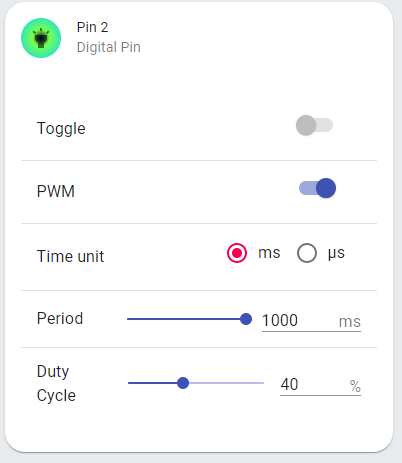
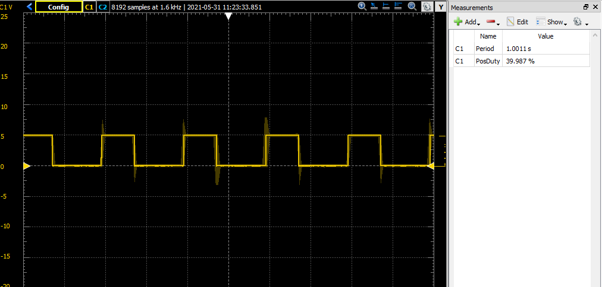

# Arduino PWM Generator
#### Generate pulse width modulation, control brightness, and toggle the digital PINs of an Arduino ONE.

## Features

- Toggle On/Off each digital PIN from the web interface
- Activate pulse width modulation and specify period and duty cycle.
- Select between two time modes: microseconds or milliseconds.
- Control the brightness of a LED or a velocity of a motor with PWM.

I used the Material UI and bootstrap React components for the user interface.

## Interface:


That's how the UI looks on my web browser. The design could be improved but the functionality works.

# Examples:

Enabling PWM (pulse-width-modulation) with a period of 1 second and a duty cycle of 40%.



This is the output waveform I get on the oscilloscope using Analog Discovery 2:




## How to use

You need to install [Node.js](https://nodejs.org/).

Clone this repository 
```sh
git clone https://github.com/FreddyB1/Arduino-React-Controller.git
```

Connect your Arduino ONE to your computer and upload the code on the file `arduino.ino` found on the arduino folder.

Open the projectConfig.js file on the main directory and change the `arduinoPort` to the port COM port your Arduino is connected to.

On Windows, you can see the COM port by going into Device Manager > Ports(COM & LPT)
```
arduinoPort: "COM5"
```

On the main directory run the command
```sh
npm start
```

## License
MIT
